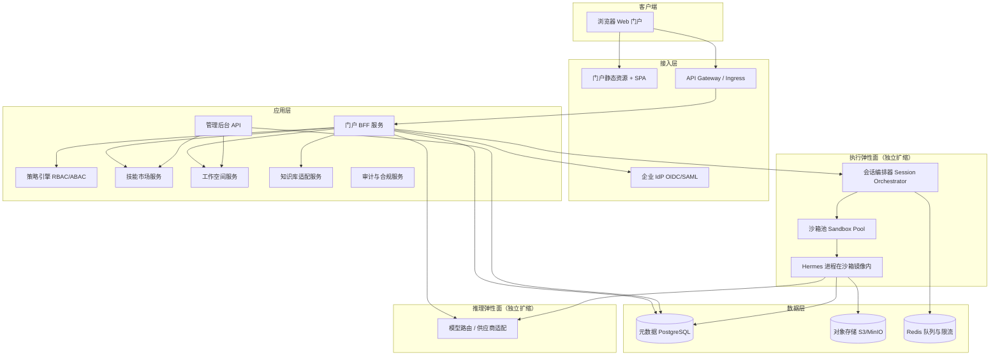
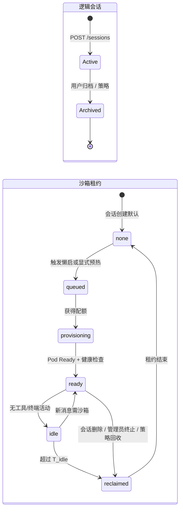

# Hermes 企业级门户与多租户部署规格书

> **版本**：1.2  
> **适用范围**：在保留现有 Hermes 智能体核心架构与能力的前提下，建设统一 Web 门户、企业身份、知识库对接、多租户隔离、公共技能市场、公共工作空间与会话级沙箱的企业级部署方案。  
> **基线代码库**：`run_agent.py`（`AIAgent`）、`model_tools.py`、`hermes_state.py`（`SessionDB` / SQLite）、`hermes_constants.get_hermes_home()`、`gateway/`、`tools/`、`skills/`、MCP 与插件体系（参见仓库根目录 `AGENTS.md`）。  
> **企业约束基线**：知识库与身份模型见 §6.4；沙箱出站 **仅内网** 见 §10.1；推理以 **自建 vLLM（OpenAI 兼容）** 为主、可选商业 API 见 §3.3 与 §3.4；公共文件 **DLP / 杀毒 / 数据分类** 见 §9；**境内部署与日志不出境** 见 §11.5；**纯对话可不分配沙箱** 见 §5.2 与 §10.2。

本文档面向架构师与后端/前端/平台工程师，可直接作为分解任务与接口契约的开发依据。

**架构范式（全文以此为准）**：本平台采用与业界主流 Agent 产品同构的 **「多租户编排 + 短时隔离执行环境 + 独立状态存储」** 三层骨架——**编排层**负责身份、会话路由、配额、队列、市场与工作空间策略；**执行层**在需要时拉起 **可丢弃的沙箱**（内跑完整 Hermes 运行时与 Node/Python 等依赖），按会话或按任务回收以控成本；**状态层**将会话与业务元数据持久化，与计算进程解耦。在此骨架之上叠加企业 IdP、知识库适配、技能市场、公共工作空间与审计，不改变该范式，仅增加控制面与数据面的职责边界。

---

## 1. 目标与范围

### 1.1 业务目标

| 编号 | 需求 | 本文档中的落点 |
|------|------|----------------|
| R1 | 网页门户作为统一入口 | §3 总体架构、§5 BFF/API |
| R2 | 企业域账号，员工皆可登录 | §4 身份与访问、§5.1 认证接口 |
| R3 | 接入企业知识库（API），问答检索；知识库侧已做文档权限，平台不再重复做文档级权限 | §6 知识适配层 |
| R4 | 每用户：个性化配置、记忆、会话历史、技能/工具、个人工作空间、运行时相互独立 | §7 多租户模型 |
| R5 | 个人技能空间 + 公共技能市场；市场支持后台管理、审核、版本、权限；个人可提交、审批后对他人可见 | §8 技能与工具市场 |
| R6 | 公共工作空间（文件共享）+ 后台权限与审批；与个人空间的关系：下载可见文件、按策略上传 | §9 工作空间 |
| R7 | 沙箱隔离与动态加载：指令在沙箱执行；沙箱仅能访问个人工作空间（及经授权的公共资源）；按会话启停；资源不足排队 | §10 沙箱与执行队列 |

### 1.2 非目标（首期可明确排除或降级）

- 在平台侧重建企业知识库的文档级 ACL（由企业知识库服务负责）。
- 替换 Hermes 内部 LLM 工具循环为另一套 Agent 框架（保留 `AIAgent` 语义与工具协议）。
- 移动端原生 App（Web 门户响应式即可作为后续扩展）。

### 1.3 设计原则

1. **租户边界**：以「企业组织」为租户；以「用户 ID」为资源隔离主键；**会话**为逻辑对话边界；**沙箱**为短时计算边界，二者生命周期可分离（见 §10.2）。  
2. **最小信任面**：门户与 BFF 验证身份；执行层只接受带签名的短期凭证或内网 mTLS。  
3. **与 Hermes 对齐**：每个逻辑用户映射到独立的 `HERMES_HOME`（或等价路径布局），以复用现有 `SessionDB`、技能目录、插件与 MCP 加载逻辑。  
4. **可观测**：按 `tenant_id`、`user_id`、`session_id`、`sandbox_id` 打点与日志关联。  
5. **双弹性面**：**模型推理**与 **沙箱执行** 分别扩缩容、分别限流与分别做容量规划（见 §3.3、§11.2），禁止混为单一「Agent 池」指标。  
6. **懒启沙箱**：并非每个会话创建即分配沙箱；仅在需要执行高风险路径时申请（见 §10.2）；**纯对话路径可不分配沙箱**（见 §3.4、§5.2），以降低门户流量对执行集群的无效尖峰。  
7. **状态分层**：平台级元数据（租约、安装记录、审批、审计）走 **PostgreSQL**；Hermes 会话消息与 FTS 等仍走用户域内 **`state.db`**，二者职责清晰，避免「所有状态塞进一份 SQLite」导致运维与报表困难（见 §7.0）。  
8. **公共卷挂载安全**：公共工作空间在沙箱内 **默认只读挂载**，且 **不得** 作为可写根与用户 `hermes_home` 混为同一可写树；写公共对象一律走平台 API / 旁路服务（见 §9、§10.3）。

---

## 2. 现状基线（Hermes 侧）

开发集成时应显式依赖以下既有概念（详见 `AGENTS.md`）：

- **Agent 核心**：`AIAgent` 同步工具循环、`handle_function_call()`、工具集 `toolsets.py`。  
- **会话与历史**：`hermes_state.SessionDB`（SQLite + FTS5），路径默认 `get_hermes_home() / "state.db"`。  
- **配置与密钥**：用户级 `config.yaml`、`.env`（仅密钥），由 `hermes_cli/config.py` 等加载。  
- **技能**：仓库内 `skills/`、`optional-skills/`，用户目录 `~/.hermes/skills/`（企业部署中映射为每用户目录）。  
- **MCP / 插件**：`mcp_servers` 配置、插件注册与工具发现（`model_tools.py` / `PluginManager`）。  
- **终端与执行后端**：`tools/environments/`（本地、Docker、SSH、Modal、Daytona 等）——企业沙箱应对齐其中一种或封装为统一 **Sandbox Driver**。  
- **提示词与工具缓存**：Hermes 强调 **不在会话中途改变工具集 / 系统提示结构** 以免破坏 prompt 缓存（`AGENTS.md`）；门户与 BFF 的「改技能 / 改 MCP」能力必须与 **「下一会话生效」或「用户显式结束当前会话后立即生效」** 的产品策略一致（见 §5.3、§8.5）。

企业化时关键改造点：**将「单用户本机 HOME」扩展为「按用户划分的受控 HOME + 按需申请的会话沙箱」**，并在网关层注入 `tenant/user/session` 上下文。

---

## 3. 总体架构

### 3.1 逻辑架构（分层）



**职责简述**：

| 组件 | 职责 |
|------|------|
| **门户 SPA** | 聊天 UI、会话列表、技能市场、工作空间浏览器、管理端入口；不直连执行层。 |
| **BFF** | 聚合接口、OAuth2/OIDC 回调、将 IdP `sub` 映射为内部 `user_id`、颁发会话 Cookie / 前端可见的短期 Token。 |
| **API Gateway** | TLS、mTLS（可选）、WAF、限流、路由、请求体大小限制。 |
| **模型路由（推理面）** | **主路径**：自建 **vLLM**（或同类），对外统一 **OpenAI 兼容** HTTP API（`/v1/chat/completions` 等）；**可选**：经同一适配层接入商业模型。负责鉴权、计费、重试、流式透传；**与沙箱进程解耦**，可水平扩展。 |
| **会话编排器** | 会话 CRUD、**按需**申请/回收沙箱、排队、租约写入 MetaDB；向沙箱内 Agent 注入 `HERMES_HOME`、环境变量、工具白名单。 |
| **沙箱池** | 每沙箱一个隔离单元（推荐 K8s Pod + `runsc`/gVisor 或 microVM 类运行时）；卷挂载、网络策略、cgroup 限额。 |
| **沙箱内 Hermes** | **完整** Hermes 运行时（`AIAgent`、工具、MCP 客户端等）跑在沙箱镜像的入口进程中；**gVisor 等运行时替换的是容器底层的 `runc`，不缩小为「仅 Node/Python 解释器」**——镜像与入口仍应是 Hermes 会话 worker。 |
| **技能市场服务** | 目录、版本、审批流、发布、权限元数据；向个人空间同步已授权制品；安装记录写入 MetaDB。 |
| **工作空间服务** | 个人卷与公共卷的元数据、上传下载 URL（预签名）、审批任务；**公共卷对沙箱侧以只读暴露为主**。 |
| **知识库适配** | 将 **与用户域身份绑定** 的凭据（推荐 **UAT** 或 **OBO** 换发的 KB 访问令牌）转发给企业知识库 **内网** API，使知识库沿用既有「按账户」的文档范围（见 §6.1、§6.4）。 |
| **元数据库（PostgreSQL）** | 用户、组织、角色、市场条目与安装、**沙箱租约**、审批单、审计事件、配额计数器；**不替代** `state.db` 中的消息 FTS 职责。 |

### 3.2 物理部署建议（Kubernetes 示例）

- **命名空间**：`hermes-enterprise-{env}`（资源组与区域须位于 **中国境内**，见 §11.5）。  
- **工作负载（拆分）**：  
  - **控制面**：`bff`、`admin-api`、`marketplace`、`workspace`、`kb-adapter`、`session-orchestrator`（Deployment，HPA 按请求延迟与队列深度）。  
  - **推理面**：`llm-proxy` 或供应商 SDK 边车（Deployment/HPA，指标：RPM、token 延迟、429 率）。  
  - **执行面**：`hermes-sandbox`（每会话或每租约一个 Pod，由编排器创建；或 Job + 上限并行度）；可选节点池启用 **gVisor (`runsc`)** 或 **Kata/Firecracker**；`sandbox-worker` 可为 DaemonSet 负责本地镜像预热（可选）。  
- **存储**：PostgreSQL（HA）、Redis（Cluster/Sentinel）、S3 兼容对象存储；**SQLite `state.db` 必须落在可写块存储或 emptyDir，且每用户一份（推荐）或每会话一份（若强制会话级完全隔离）**，避免 NFS + WAL 问题（参见 `hermes_state.py` 中 WAL 兼容性说明）。  
- **密钥**：Vault / External Secrets Operator；企业 API Key 不入镜像。

### 3.3 双弹性面与容量规划

| 弹性面 | 主要负载 | 典型扩缩指标 | 与另一面的关系 |
|--------|----------|----------------|----------------|
| **推理面** | LLM 请求、流式输出 | RPM、并发流、首 token 延迟、供应商配额 | **有沙箱** 时 Agent 经内网调 `llm-proxy`；**纯对话无沙箱** 时由控制面 worker 调同一推理面（见 §3.4、§5.2）。推理集群 **不** 与沙箱一一对应副本。 |
| **执行面** | 终端、代码执行、部分 MCP、文件工具 | 活跃沙箱数、队列深度、冷启动时延、OOM 率 | 沙箱数量由 **用户行为** 驱动；门户 PV 高不等于沙箱多（见 §10.6）。 |

**成本与 SLO**：两路分别设 **上限与告警**（例如租户级最大并发沙箱、与模型 TPM 封顶），避免一侧耗尽导致另一侧雪崩。

### 3.4 企业与合规基线（已确认，实施须满足）

以下条目为 **企业方已确认的约束**，作为环境设计、网络策略与验收测试的硬输入；若与某云厂商默认架构冲突，以本节约束为准并单独做差距分析。

| 域 | 约束 |
|----|------|
| **沙箱出站网络** | **仅允许企业内网**（RFC1918 / 企业私网段 / 经批准的专线目的地）。**默认拒绝访问公网**；模型路由、知识库、Git、制品与包管理（NPM/PyPI 等）均须为 **内网 VIP 或内网代理**，**不得**依赖沙箱直连互联网。与「气隙（完全无外联）」不同：本方案允许 **受控内网** 访问，仍 **禁止** 任意公网 egress。 |
| **模型推理** | **以自建 vLLM（或等价）为主**；后续可经同一 **OpenAI 协议** 适配层接入商业 API。推理集群部署在 **中国境内** 合规区域（与 §11.5 一致）。 |
| **公共文件** | 上传与分发链路须集成 **DLP 检测**、**杀毒 / 恶意软件扫描**（或等效沙箱扫描服务）及 **数据分类标签**（元数据与策略引擎可读），并与审批流、检索过滤联动（见 §9）。 |
| **数据驻留与日志** | 全栈生产部署位于 **中国境内**；**日志、链路追踪、备份与运维导出不得出境**；若使用可观测性 SaaS，须 **境内专区** 或自建（见 §11.5）。 |
| **纯对话与沙箱** | **仅模型对话**（及通过内网 KB Adapter 的 HTTP 检索、不涉及子进程与本地可写工作区工具）时，**允许不分配沙箱**，以节省执行面；一旦触发 §5.2 懒启条件，必须申请沙箱租约。 |

---

## 4. 身份与访问（R2）

### 4.1 协议选择

- **首选**：OIDC（OAuth2 + OpenID Connect），与企业 Azure AD / Okta / Keycloak / 飞书 / 企业微信等集成。  
- **备选**：SAML 2.0，由 BFF 或专用 `saml-bridge` 转换为内部 JWT。

### 4.2 身份映射

- **外部主体**：`idp_subject` + `idp_issuer`（或租户特定 `email`）唯一确定用户。  
- **内部用户表**：`users(id, tenant_id, idp_issuer, idp_subject, email, display_name, status, created_at)`。  
- **首登开通**：JIT Provisioning，默认角色 `employee`；管理员由 `tenant_admins` 表或 IdP Group 映射。

### 4.3 Token 与调用链

1. 用户在门户完成 OIDC 登录。  
2. BFF 维护 **HttpOnly Session** 或 **BFF 签发的 JWT**（短 TTL，如 15m），包含 `user_id`、`tenant_id`、`roles[]`。  
3. BFF 调用下游（编排器、市场、工作空间）使用 **mTLS** 或 **服务账号 JWT**；**不得**将用户 Refresh Token 下传到沙箱。  
4. 调用企业知识库时：在 **企业域账户同时适用于 Agent 与知识库**、且 **知识库已按账户配置好查询范围** 的前提下，优先采用 **用户身份直持令牌（UAT）** 或 **OBO 换发的 KB 访问令牌**（见 §6.4）；**不推荐**默认采用「平台服务账号代调 + 自行传 user_id」除非知识库明确提供 **可信调用方模拟（impersonation）** 契约并完成法务与安全评审。

### 4.4 RBAC 角色（建议）

| 角色 | 说明 |
|------|------|
| `employee` | 使用门户、个人资源、浏览市场授权内容。 |
| `workspace_admin` | 管理公共工作空间策略与审批。 |
| `market_admin` | 技能/工具上架、版本、权限模板。 |
| `security_auditor` | 只读审计与导出。 |
| `tenant_super_admin` | 租户级配置、紧急禁用。 |

---

## 5. 门户与 BFF 接口设计

以下 REST 路径前缀建议：`/api/v1`。WebSocket：`/ws/v1/chat`。

### 5.1 认证与用户

| 方法 | 路径 | 说明 |
|------|------|------|
| `GET` | `/auth/login` | 重定向至 IdP 授权端点（PKCE）。 |
| `GET` | `/auth/callback` | OIDC 回调，建立会话，创建/更新 `users`。 |
| `POST` | `/auth/logout` | 清除会话，可选 IdP 全局登出。 |
| `GET` | `/me` | 当前用户 profile、`roles`、配额摘要（含推理与沙箱维度，见 §11.3）。 |

**`GET /me` 响应示例**

```json
{
  "user_id": "usr_2v7k...",
  "tenant_id": "ten_acme",
  "email": "zhang@acme.com",
  "display_name": "Zhang",
  "roles": ["employee"],
  "quotas": {
    "max_concurrent_sessions": 4,
    "max_concurrent_sandboxes": 2,
    "sandbox_queue_priority": "normal",
    "max_daily_llm_tokens": null
  }
}
```

### 5.2 会话与对话（编排器代理）

| 方法 | 路径 | 说明 |
|------|------|------|
| `GET` | `/sessions` | 分页列出会话元数据（标题、更新时间、来源 `web`）；元数据以 MetaDB 为准或与 `state.db` 同步策略在实现中选定。 |
| `POST` | `/sessions` | 创建逻辑会话，返回 `session_id`；**默认不创建沙箱**（懒启，见 §10.2）。 |
| `GET` | `/sessions/{session_id}` | 会话详情、配置快照版本、`sandbox_status`（`none` / `queued` / `ready` / `reclaimed`）。 |
| `POST` | `/sessions/{session_id}/sandbox` | **可选**：显式预热沙箱（高级用户或企业策略）；返回租约 id。 |
| `PATCH` | `/sessions/{session_id}` | 更新标题、归档等。 |
| `DELETE` | `/sessions/{session_id}` | 软删除或策略删除；编排器 **回收** 关联沙箱租约。 |
| `WS` | `/ws/v1/chat?session_id=` | 双向流：用户消息、模型流式增量、工具事件、审批提示；首条需沙箱的消息若沙箱为 `none`，编排器 **异步** 置 `queued`→`ready` 并推送 `sandbox_status`。 |

**懒启触发条件（须在 BFF/编排器与 Agent 侧一致实现）**：下列任一能力被调用或用户显式预热时，才为该 `session_id` 申请沙箱——**终端类工具**、**代码执行**、**需本地子进程的 MCP（stdio）**、**企业策略标记为「强隔离」的文件写路径**、**对用户工作区的写操作**等。**已确认企业策略**：**纯对话**（仅经内网的模型推理调用，及 **仅 HTTP**、走 KB Adapter 的知识库检索，**不**创建子进程、**不**写本地工作区）时 **`sandbox_status` 可保持 `none`**，Hermes 可运行于控制面会话 worker 或等价无沙箱路径，以最大化节省执行面。除上述纯对话路径外，默认仍偏保守：**凡触达用户可写文件系统或子进程创建，必须已有沙箱**。

**WebSocket 消息帧（JSON）** — 建议枚举 `type`：

- `user_message`：用户文本/附件引用。  
- `assistant_delta` / `assistant_final`：模型输出。  
- `tool_start` / `tool_progress` / `tool_result`：对齐 TUI JSON-RPC 语义，便于复用 `tui_gateway` 事件模型。  
- `sandbox_status`：`none` | `queued` | `provisioning` | `ready` | `reclaimed` | `error`。  
- `error`：可机读 `code` + 人类可读 `message`。

### 5.3 用户设置与技能 / MCP 生效策略（R4 + Hermes 约束）

| 方法 | 路径 | 说明 |
|------|------|------|
| `GET` | `/settings` | 合并后的有效设置（租户默认 + 用户覆盖）。 |
| `PUT` | `/settings` | 用户级覆盖（模型偏好、界面、**非密钥**项）。 |
| `GET` | `/settings/secrets/keys` | 仅返回密钥名称列表（不返回值）。 |
| `PUT` | `/settings/secrets` | 写入用户密钥（加密存储，见 §7.3）。 |

**与 Hermes 行为对齐的硬性产品规则**（须在 UI 与 API 文案中写死）：

1. **默认**：用户修改 `skills`、`mcp_servers`、启用插件列表等 **仅写入配置与 MetaDB**，**当前已连接 WebSocket 会话不热重载工具模式**；下一 **新会话** 或用户执行 **「结束会话并应用」** 后读取新配置。  
2. **显式立即生效（可选功能）**：仅当用户确认 **中断当前对话上下文**（等价于关闭当前会话连接并新建会话）时，才允许 `PUT /settings?apply=session_restart` 一类语义强制编排器回收沙箱并以新工具集重建——须提示 **成本与缓存失效**（参见 `AGENTS.md` 中「缓存感知」的 `/skills install --now` 模式）。  
3. **市场安装**：`POST /market/.../install` 成功后，**已运行中的沙箱内进程不自动挂载新制品**；由下次沙箱创建或会话重启拉取 `skills_installed/` 与合并后的 `config.yaml`。

### 5.4 管理端（聚合入口）

| 方法 | 路径 | 说明 |
|------|------|------|
| `GET` | `/admin/audit` | 筛选审计日志（需 `security_auditor` 或更高）。 |
| `GET` | `/admin/quotas/users/{user_id}` | 配额与使用量（分推理与沙箱维度）。 |

具体市场与工作空间管理接口见 §8、§9。

---

## 6. 企业知识库接入（R3）

### 6.1 组件：知识库适配服务（KB Adapter）

- **输入**：`user_context`（与域身份一致的 `user_id` / `email` / IdP `sub`，以知识库 API 契约为准）、自然语言 `query`、可选 `session_id`（用于审计关联）。  
- **输出**：`chunks[]`（文本片段、引用、得分）、`request_id`。  
- **鉴权（与 §6.4 一致）**：调用知识库 HTTP 时须携带 **与用户会话绑定的访问令牌**（用户直持 **UAT**，或经 **OBO** 换发的 KB 专用 access token），使知识库侧 **沿用已为各域账户配置好的文档可见范围**；平台 **不在本地重建文档级 ACL**。  
- **网络**：KB Adapter 与知识库服务端点均须在 **企业内网** 可达；与 §3.4、§10.1 的「禁止沙箱/组件任意公网 egress」一致。  
- **平台责任**：缓存策略（短 TTL）、超时、重试、审计日志；**不在平台存储文档 ACL**。  
- **与沙箱关系**：在 **纯对话无沙箱** 路径下，KB Adapter 可由 **BFF 侧车或控制面 worker** 调用（仍须用户绑定令牌）；若会话已分配沙箱，也可仅允许沙箱内网访问 KB——二者可并存，**令牌不落日志明文**。

### 6.2 对 Agent 的注入方式（推荐）

1. **工具层封装**：提供统一工具 `enterprise_kb_search(query)`（名称可配置），内部 HTTP 调用 KB Adapter。  
2. **系统提示词片段**：在会话开始时将「知识库检索结果摘要规则」注入 system prompt（保持与现有 prompt 缓存策略一致，避免会话中途突变）。  
3. **可选 RAG 管道**：编排器在 `user_message` 到达前并行调用 KB Adapter，将 `context_prefix` 作为隐藏前缀附加到首条模型请求（需注意 token 上限）。

### 6.3 KB Adapter REST（对内）

| 方法 | 路径 | 说明 |
|------|------|------|
| `POST` | `/internal/kb/search` | Body: `{ "query", "top_k", "filters" }`；Header: `X-Tenant-Id`, `X-User-Id`（审计维度）, `Authorization: Bearer <用户绑定令牌>`（UAT 或 OBO 换发，见 §6.4）。 |

### 6.4 知识库 API 凭据模型：UAT、OBO 与「服务账号 + 传递 user_id」

企业知识库 **已为每个域账户配置好查询范围** 时，目标是：每一次检索在知识库看来仍是 **「该用户本人」** 在访问，从而 **自动套用库内既有权限**，平台侧 **不** 再做文档级授权。

| 模式 | 含义 | 与「域账户已控范围」的匹配 |
|------|------|------------------------------|
| **UAT（User Access Token，用户访问令牌）** | 终端用户登录后持有的 **资源访问令牌**（或等价 session cookie 经 BFF 换成的 KB 可接受 Bearer），**调用方在 KB 侧表现为用户本人**。 | **最直**：KB 按令牌主体做 ACL，与员工直接打开知识库一致。 |
| **OBO（On-Behalf-Of）** | 门户/ BFF 用 **用户登录态** 向 IdP 或 KB 授权服务器再换一枚 **专用于 KB API 的 access token**（受众 `aud` 指向知识库），令牌主体仍映射到 **同一域用户**。 | **同样直**：适合 KB 不接受门户 IdP 的 token、但支持 **令牌交换** 的场景；实现上多一步，安全边界清晰。 |
| **服务账号 + 知识库侧 RBAC（平台代调 + 传 user_id）** | 平台持 **固定机器身份** 调 KB，在 Header/Body 里附带 `X-User-Id` 等字段，由 **知识库信任平台** 后按传入用户做授权。 | **可行但前提强**：KB 必须实现 **可信调用方模拟**、防伪造、审计链路与 mTLS；若 KB **只认用户令牌** 而不支持代调，则 **不能** 用此模式冒充用户范围。 |

**本企业已确认**：员工使用 **同一套域账户** 使用 Agent 与知识库，且 **知识库内已按账户设定可见范围** → **首选实现为 UAT 或 OBO**（二者择一由 IdP/KB 能力决定），使 KB 侧授权逻辑 **零改造或最小改造**。仅在知识库团队提供正式 **impersonation** 规范时再考虑服务账号代调。

**实现注意**：Refresh Token **不得** 进入沙箱；KB 用 access token 应 **短 TTL**、**仅内网** 使用；日志中脱敏。

---

## 7. 多租户与用户隔离（R4）

### 7.0 平台元数据与 Hermes 运行时状态（状态分层）

| 存储 | 内容 | 运维特征 |
|------|------|----------|
| **PostgreSQL（MetaDB）** | 用户/租户/角色、市场条目与安装、沙箱租约、审批流、审计事件、配额计数、会话列表缓存（可选） | HA、备份、报表、合规查询 |
| **用户域 `state.db`（SQLite）** | 会话消息、FTS5、模型配置快照等 Hermes 既有语义 | 随用户挂载；注意 WAL 与网络文件系统限制 |
| **对象存储** | 大附件、市场制品 blob、公共/个人文件对象 | 版本、预签名；**上传须经过 DLP / 杀毒 / 分类打标流水线**（见 §9） |

**原则**：可审计、可跨会话查询的经营数据 **进 MetaDB**；Hermes 已有且性能路径敏感的消息存储 **保留 `state.db`**，避免把聊天 FTS 强行迁入关系库除非二期专项。

### 7.1 目录与 HOME 映射

每个用户分配稳定根路径（宿主机或 CSI 卷，容器内挂载）：

```text
/data/tenants/{tenant_id}/users/{user_id}/
  hermes_home/          # 等价于 HERMES_HOME
    config.yaml
    .env.secrets         # 或引用 Vault，不落盘明文
    state.db             # SessionDB
    skills/              # 个人技能空间（私有）
    skills_installed/    # 从市场安装的副本（只读挂载 + 可写 overlay 二选一）
    workspace/           # 个人工作空间根（沙箱内可读写挂载）
    plugins/             # 用户插件（若允许）
    logs/
```

**进程级环境**（由编排器在启动沙箱内 Hermes 前设置）：

- `HERMES_HOME=/data/tenants/.../hermes_home`  
- `HERMES_ENTERPRISE_USER_ID`、`HERMES_ENTERPRISE_SESSION_ID`、`HERMES_TENANT_ID`（供工具与审计使用）

### 7.2 记忆（Memory）隔离

- 使用现有 Memory Provider 插件时：**每用户一个 provider 配置与命名空间**（例如 `memory.namespace = user:{user_id}`，具体键名依插件文档）。  
- 禁止跨用户 `prefetch` 或共享向量库 collection。

### 7.3 密钥与个性化

- **用户密钥**：存 PostgreSQL + KMS 加密，或仅存 Vault 路径引用；同步到 `hermes_home/.env` 应在沙箱启动时 **一次性注入内存环境**，避免全局可写文件长期落盘（取决于威胁模型）。  
- **个性化非密钥项**：`config.yaml` 的用户覆盖层 + 租户默认层 deep-merge（语义对齐 `load_cli_config()`）。

### 7.4 会话历史

- **默认**：每用户独立 `state.db`（已隔离）。  
- **跨设备同步**：BFF 只访问该用户 HOME 对应路径上的 DB（或通过会话服务封装 CRUD）；**禁止** SQL 跨租户拼接。  
- **会话级沙箱回收**：沙箱销毁 **不** 删除 `state.db`；下一沙箱冷启动时 Hermes 按既有语义 **恢复会话**。

---

## 8. 技能与公共技能市场（R5）

### 8.1 概念模型

| 概念 | 说明 |
|------|------|
| **个人技能（Private Skill）** | 仅存在于用户 `hermes_home/skills/`，对他人不可见。 |
| **市场技能（Marketplace Item）** | 逻辑记录，关联 `artifact`（tarball、Git 引用、或 SKILL 目录快照）。 |
| **安装实例（Installation）** | 用户从市场安装到个人空间的副本，带 `item_id` + `version` + `license_ack`；**写入 MetaDB** 便于审计与卸载。 |
| **工具条目（Tool Offer）** | MCP / HTTP Plugin / 内置工具声明的组合包；同样走版本与审批。 |

### 8.2 状态机（市场条目）

```text
draft → submitted → in_review → approved → published → deprecated | rejected
```

- **个人提交**：创建 `submitted` 审核单，上传制品到对象存储临时桶。  
- **审批**：`market_admin` 或 delegate 批准 → `approved` → 可 `publish`。  
- **发布**：生成不可变版本 `vN`；已安装用户可选「提示升级」。

### 8.3 权限维度（市场侧，与知识库无关）

- **可见性**：`tenant_only` / `org_unit` / `role_based` / `user_allowlist`。  
- **执行类工具**：额外标记 `requires_security_review`、`network_egress_class`。  
- **下载与安装**：BFF 校验「用户角色 ∩ 条目 ACL」。

### 8.4 与个人空间的关系

1. 用户在市场浏览 → 仅见有权限条目。  
2. 用户点击安装 → 市场服务校验 ACL → 将制品同步到 `skills_installed/{item_key}/{version}/` 并更新用户 `config.yaml` 的 `skills` 相关节（或写入 `manifest.json` 由 Curator 识别）；**同步 MetaDB `user_installations`**。  
3. 用户提交个人技能到市场 → 创建审核单 + 恶意扫描（可选）→ 审批通过后复制到市场受控桶，**不**删除个人副本。

### 8.5 安装 / 卸载与运行中会话的一致性

- **安装完成**：不保证当前 WebSocket 会话立即可见新工具；遵循 §5.3。  
- **卸载**：从 `user_installations` 标记删除并移除文件；**当前会话** 仍可能缓存已加载工具定义直至会话结束——产品侧提示用户「结束会话后完全移除」。  
- **升级版本**：建议以 **新安装记录 + 新 semver 目录** 实现；旧版本保留直至无活跃会话引用（由清理任务回收）。

### 8.6 管理端与市场 API

**市场（用户侧）**

| 方法 | 路径 | 说明 |
|------|------|------|
| `GET` | `/market/items` | 筛选：`type=skill|mcp_bundle|plugin`、标签、分页。 |
| `GET` | `/market/items/{item_id}` | 详情、版本列表、权限说明。 |
| `POST` | `/market/items/{item_id}/install` | Body: `{ "version": "1.2.0" }`；异步任务；写 MetaDB。 |
| `DELETE` | `/market/installations/{installation_id}` | 卸载。 |
| `POST` | `/market/submissions` | 提交个人技能/工具审核。 |

**管理端（`market_admin`）**

| 方法 | 路径 | 说明 |
|------|------|------|
| `GET` | `/admin/market/submissions` | 审核队列。 |
| `POST` | `/admin/market/submissions/{id}/approve` | Body: `{ "visibility", "tags" }`。 |
| `POST` | `/admin/market/submissions/{id}/reject` | Body: `{ "reason" }`。 |
| `POST` | `/admin/market/items` | 官方直接创建条目（可跳过部分流程）。 |
| `PATCH` | `/admin/market/items/{item_id}` | 元数据、ACL、Deprecation。 |
| `POST` | `/admin/market/items/{item_id}/versions` | 上传新版本制品 + changelog。 |
| `DELETE` | `/admin/market/items/{item_id}` | 软删除，保留审计与已安装副本。 |

### 8.7 数据表（PostgreSQL 建议）

- `market_items(id, tenant_id, type, key, title, description, status, created_by, ...)`  
- `market_item_versions(id, item_id, semver, artifact_uri, checksum, release_notes, created_at)`  
- `market_item_acl(id, item_id, rule_json)` — `rule_json` 支持 OR/AND 组合。  
- `market_submissions(id, item_draft, submitted_by, state, reviewer_id, ...)`  
- `user_installations(id, user_id, item_id, version_id, installed_at, removed_at)`

### 8.8 MCP / API / Plugin 上架形态

- **MCP Bundle**：序列化为 `mcp_servers` YAML 片段 + 容器内可启动命令；**必须在沙箱网络策略白名单内** 才可启用。  
- **HTTP Tool**：OpenAPI 片段 + 认证绑定「用户密钥引用」或「服务账号」。  
- **Hermes Plugin**：符合 `plugins/` 约定；**高敏感插件默认禁止用户自行启用**，需 `tenant_super_admin` 白名单。

---

## 9. 公共工作空间（R6）

### 9.1 模型

- **卷（Volume）**：`public` 类型；**沙箱内挂载路径**建议：`/workspace/public/{volume_id}/`（**默认只读**）。  
- **对象**：文件、目录、版本（可选）；元数据须包含 **病毒扫描状态**、**DLP 判定结果**、**数据分类标签**（如：公开 / 内部 / 秘密 / 监管数据等，枚举由企业数据安全团队定义）。  
- **权限**：`read` / `write` / `admin`；支持按组织单元、组、用户 ACL；**列表与下载须尊重分类标签**（例如秘密级对象对无标签用户不可见）。  
- **审批**：上传策略为 `requires_approval` 时，文件先进入 `quarantine/` 元数据状态；**DLP/杀毒/分类** 完成后进入人工或自动审批，通过后迁入正式前缀。  
- **与可写根隔离**：**禁止**将公共卷以可写方式挂载到 `hermes_home` 子树内与 `workspace/` 混用同一写权限；避免工具路径混淆导致误写或路径逃逸感知的复杂度上升。

### 9.1.1 安全处理流水线（已确认必配）

1. **杀毒 / 恶意软件**：上传对象进入隔离区后异步扫描；未通过则阻断发布并审计通知。  
2. **DLP**：对文本与可解析文档做策略匹配（关键字、正则、标识符类）；命中策略则标记、阻断或降级为「仅管理员可见」。  
3. **数据分类标签**：由自动分类器、用户声明或 DLP 结果综合写入元数据；供检索过滤、下载水印、保留期限与 **境内日志** 中的最小化展示使用。  
4. **与 Agent**：沙箱内 **只读** 挂载已通过扫描与发布的对象子集；未发布对象 **不可** 挂载进沙箱。

### 9.2 与个人空间的关系

| 操作 | 规则 |
|------|------|
| 下载 | 用户对对象有 `read` 即可通过预签名 URL 下载；门户内联打开走同一鉴权。 |
| 上传到公共 | 需要 `write` 且满足上传策略；**优先**经 **工作空间服务 API** 写入对象存储，而非沙箱内直接写 `/public`（沙箱内默认无公共写挂载）。 |
| Agent 读公共文件 | **只读挂载** ` /workspace/public/...` 或封装 `public_file_read(path)` 工具，路径校验前缀 + 禁止 `..`。 |
| Agent 写公共 | **默认关闭**；若业务必须，采用 **sidecar 上传**（Agent 调用受控 API，由 WSvc 写入对象存储并触发审批流），**不**开放沙箱对公共前缀的 RW 挂载。 |

### 9.3 API

| 方法 | 路径 | 说明 |
|------|------|------|
| `GET` | `/workspaces/personal` | 根信息、用量。 |
| `GET` | `/workspaces/public` | 列出用户可见公共卷。 |
| `GET` | `/workspaces/public/{volume_id}/objects` | 列举对象。 |
| `POST` | `/workspaces/public/{volume_id}/uploads` | 申请上传 URL（POST-policy 或 STS）。 |
| `POST` | `/workspaces/public/{volume_id}/approvals` | 提交审批（若需要）。 |

**管理端（`workspace_admin`）**

| 方法 | 路径 | 说明 |
|------|------|------|
| `POST` | `/admin/workspaces/public` | 创建卷与策略。 |
| `PATCH` | `/admin/workspaces/public/{volume_id}/acl` | 修改 ACL。 |
| `GET` | `/admin/workspaces/approvals` | 审批队列。 |
| `POST` | `/admin/workspaces/approvals/{id}/resolve` | approve / reject。 |

---

## 10. 沙箱隔离与动态加载（R7）

### 10.1 威胁模型与目标

- 用户代码 / 终端指令 **不得** 读取主机其他租户数据或宿主机敏感挂载。  
- **出站网络（已确认）**：**仅允许访问企业内网目的地**（模型路由、知识库、Git、制品库、内网 NPM/PyPI 代理、WSvc 等经批准的 VIP/域名解析到内网）。**默认拒绝访问公网**（含 0.0.0.0/0 放行）。**注意**：「仅内网」**不等于**「气隙」：气隙为无外联；本企业约束为 **可内网联机、不可直连互联网**。  
- 资源：CPU / 内存 / PIDs / 临时存储上限； wall-clock 最大会话时长。  
- **容器运行时语义**：以 **K8s Pod + OCI 镜像** 为例，`runsc`（gVisor）替换的是 **runc**，镜像入口进程仍是 **Hermes 会话 worker（完整 Python 栈 + 可选 Node 供 npx 等）**；不是「仅启动空壳解释器」除非二期刻意拆分架构。

### 10.2 会话生命周期与沙箱生命周期（分离）

**逻辑会话**（`session_id`）可由 MetaDB + `state.db` 长期存在；**沙箱**为短时租约。二者分离以避免「打开门户即占满执行集群」。



- **懒启触发**：见 §5.2；编排器在 MetaDB 写入 `sandbox_leases(session_id, pod_name, phase, expires_at)`。  
- **排队**：`session-orchestrator` 维护每租户与用户 **最大并发沙箱**；Redis ZSET 按优先级排队。  
- **显式预热**：`POST /sessions/{id}/sandbox` 用于低延迟场景（可选配额）。  
- **恢复**：沙箱在 `reclaimed` 后，下一条需沙箱的消息重新走 `queued`；Hermes 从 `state.db` **恢复对话**，用户可能感知冷启动延迟——由 UI 展示 `sandbox_status` 管理预期。

### 10.3 挂载策略（强制约束）

| 挂载点 | 权限 | 内容 |
|--------|------|------|
| `/hermes` | RW | 用户 `hermes_home`（可策略裁剪为仅 `workspace` + `state.db` + `skills*`） |
| `/workspace/public` | **RO** | 经 ACL 过滤后的公共卷子树前缀；**禁止默认 RW** |
| `/tmp` | RW | 临时层，ephemeral |

**工具适配**：`terminal`、`read_file`、`write_file` 等路径必须限制在 `/hermes` 与显式白名单（通过 wrapper 或 FUSE 沙箱）；**公共写** 走 API，不开放 RW 挂载（见 §9.2）。

### 10.4 Sandbox Driver 抽象（实现任务）

建议接口（语言不限，此处为逻辑接口）：

```text
provision_lease(session_id, user_id, mounts, resource_class, runtime_class) -> lease_id
attach_process(lease_id) -> hermes_worker_handle
destroy_lease(lease_id) -> void
```

**实现选项与合规档位**：

| 档位 | 技术 | 说明 |
|------|------|------|
| **推荐默认** | K8s + **gVisor (`runsc`)** + 非特权 Pod + 只读根文件系统 + NetworkPolicy | syscall 拦截层强化；运维与云厂商集成成熟 |
| **更强隔离** | **Kata Containers / Firecracker** microVM | 近似 VM 边界；冷启动与密度成本略高 |
| **托管替代** | Daytona、Modal 等 | 仅当供应商提供 **中国境内** 部署、满足 **日志不出境** 且通过采购安全评审时可选；否则不采用。 |

### 10.5 与 Hermes `tools/environments` 对齐

- 短期：封装现有 **Docker** 或 **远程** 后端，增加「每租约镜像入口」与挂载表。  
- 长期：统一为 **SessionOrchestrator → SandboxDriver → 沙箱内 Hermes** 管道；CLI/TUI 与企业门户 **共用同一镜像 digest** 时，可最大限度保证「开发环境与线上一致」。

### 10.6 容量与流量：门户访问 ≠ 沙箱压力

- **门户 PV、WebSocket 连接数** 主要消耗 **BFF / API Gateway** 与推理面连接；**不等于** 沙箱数量。  
- **沙箱压力** 由 **并发租约数**、冷启动频率与镜像体积决定；通过 **懒启**、**每用户 `max_concurrent_sandboxes`**、**租户公平队列**、**T_idle 回收**、**（可选）小热池** 控制。  
- **扩缩**：执行面节点池 HPA 建议指标为 **队列深度、pending Pod 数、已分配租约 CPU/内存**；与推理面 HPA **分离**。

---

## 11. 横切能力

### 11.1 审计日志

记录：`actor`、`tenant_id`、`user_id`、`session_id`、`sandbox_lease_id`、`action`、`target_type`、`target_id`、`ip`、`user_agent`、`payload_hash`（避免存敏感正文）。  
保留期与导出格式符合企业合规。

### 11.2 观测与 SLO（分面指标）

**推理面**：供应商 429 率、首 token P95、RPM、流式断开率。  
**执行面**：沙箱排队时间、冷启动 P95、活跃租约数、OOM、工具失败率。  
**追踪**：OpenTelemetry，跨 BFF → 编排器 → 沙箱 → 模型路由，`trace_id` 贯通。  
**日志**：结构化 JSON。

### 11.3 配额与限流（分面）

- **每用户**：`max_concurrent_sessions`（逻辑会话）、`max_concurrent_sandboxes`（执行租约）、`max_daily_kb_calls`、`max_storage_bytes`、`max_daily_llm_tokens`（可选）。  
- **每租户**：聚合限流 + 公平队列（防止单用户占满池）；**推理 TPM 与沙箱并发** 分别封顶。

### 11.4 备份与灾难恢复

- **PostgreSQL**：PITR。  
- **对象存储**：版本控制；若启用跨区域复制，**复制目标须仍位于中国境内合规区域**，且不得构成事实上的日志或数据出境通道。  
- **用户 `state.db`**：随用户卷 **块级快照** 或应用级备份；备份时保证文件一致性（SQLite 在运行中备份需快照卷或 Hermes 静止窗口）。  
- **沙箱镜像**：不可变 tag + digest 记录于 CI/CD，满足供应链审计。

### 11.5 境内部署、日志与可观测性（已确认）

- **运行域**：生产环境全部工作负载（控制面、推理面、执行面、数据面、KB Adapter、对象存储主副本）部署在 **中国境内** 合规机房或 **境内专区** 云资源。  
- **日志与追踪**：应用日志、审计日志、访问日志、链路追踪 **默认存储在境内**；禁止同步至境外 SaaS，除非经 **数据出境安全评估** 并改造为境内落地。  
- **备份与运维导出**：备份集、故障转储、渗透测试包 **不出境**；第三方支持远程排障须使用 **境内跳板** 或脱敏副本。  
- **商业模型 API（若启用）**：调用路径仍经 `llm-proxy`，须记录 **数据最小化** 与 **供应商数据处理地**；若供应商处理环节在境外，须单独走 **出境评估** 或改用境内推理。  
- **可观测性组件**：Prometheus / Loki / Jaeger 等 **自建在境内**；禁用默认会把数据发往境外的云厂商 APM 配置。

---

## 12. 安全清单（开发验收）

- [ ] 所有 API 除登录回调外需认证；管理端需 RBAC。  
- [ ] 对象存储 URL 一次性、短时、最小权限前缀。  
- [ ] 沙箱内无宿主 Docker socket、无 kubeconfig；沙箱与执行面 **NetworkPolicy**：**仅内网 egress**，拒绝任意公网；IMDS 等元数据访问按云厂商最佳实践阻断或限流。  
- [ ] 公共卷对沙箱 **默认只读**；公共写仅经 WSvc API / sidecar。  
- [ ] 跨租户路径访问单元测试与模糊测试。  
- [ ] 市场制品完整性：`checksum` + 可选签名。  
- [ ] 依赖扫描与镜像 CVE 门禁。  
- [ ] 公共对象 **DLP + 杀毒 + 数据分类** 流水线与元数据字段验收（§9.1.1）。  
- [ ] **境内** 部署与 **日志/追踪/备份不出境** 验收（§11.5）。  
- [ ] 知识库调用携带 **用户绑定令牌**（UAT 或 OBO），**禁止**无契约的服务账号冒用用户范围（§6.4）。  
- [ ] **纯对话无沙箱** 与 **懒启沙箱** 路径的 E2E 测试（权限与令牌不落沙箱）（§5.2）。  
- [ ] `llm-proxy` 对 vLLM 与可选商业后端的 **OpenAI 兼容** 契约测试（§3.4）。  
- [ ] 技能 / MCP 变更与 **会话缓存策略** 的 UI/API 一致性验收（§5.3）。

---

## 13. 分阶段交付建议

| 阶段 | 内容 |
|------|------|
| **M1** | OIDC 登录、门户壳、BFF、`/me`、`/sessions`、单用户 Hermes 进程无沙箱（PoC）；模型经 `llm-proxy`。 |
| **M2** | 每用户 `HERMES_HOME`、SessionDB 隔离、WebSocket 对话、MetaDB 用户/审计、基础审计。 |
| **M3** | 会话沙箱 + **懒启** + 排队 + 个人工作空间挂载；终端/文件工具路径加固；公共卷 **只读** 挂载。 |
| **M4** | KB Adapter + `enterprise_kb_search`；分面观测与分面配额。 |
| **M5** | 技能市场（安装写 MetaDB / 文件）、提交与审批流；§5.3 生效策略落地。 |
| **M6** | 公共工作空间上传/审批与 WSvc 写路径；**DLP/杀毒/分类** 全链路；高可用与压测（门户与沙箱分面）；**境内日志与不出境** 专项验收。 |

---

## 14. 与现有代码的映射表（便于排期）

| 企业特性 | Hermes 现有锚点 |
|----------|-----------------|
| Agent 循环 | `run_agent.py` |
| 工具注册/执行 | `model_tools.py`, `tools/registry.py` |
| 会话持久化 | `hermes_state.py` |
| HOME 与路径 | `hermes_constants.get_hermes_home()` |
| MCP | `mcp_servers` 配置与原生 MCP 客户端技能 |
| 网关事件 | `gateway/run.py`，可对齐 WebSocket 事件形状 |
| 多环境执行 | `tools/environments/` |
| 技能发现 | `agent/skill_commands.py`, `tools/skills_hub.py` |
| 缓存感知命令 | `AGENTS.md`「Prompt Caching Must Not Break」、`/skills install --now` 模式 |

---

## 15. 企业约束小结与后续细化项

### 15.1 已确认（实施基线）

| 主题 | 企业结论 | 文档落点 |
|------|----------|----------|
| 知识库身份与范围 | 域账户同时适用于 Agent 与知识库；知识库 **已按账户** 配置查询范围；平台 **首选 UAT 或 OBO**，使 KB 侧仍按 **用户本人** 授权 | §4.3、§6.1、§6.4 |
| 沙箱网络 | **非气隙**；**仅允许内网 egress**，禁止任意公网 | §3.4、§10.1 |
| 模型推理 | **自建 vLLM 为主**；后续可接 **商业 API**；对外以 **OpenAI 兼容** 协议为主 | §3.1、§3.3、§3.4 |
| 公共文件 | 需要 **DLP、杀毒、数据分类标签** | §9.1、§9.1.1 |
| 部署与日志 | **中国境内** 部署；**日志不出境** | §3.4、§11.5 |
| 纯对话与沙箱 | **纯对话可不分配沙箱** | §3.4、§5.2、§10.2 |

### 15.2 仍须在工程落地前细化的契约（非「开放」业务决策，而是接口/运维项）

- IdP 与知识库之间 **令牌交换** 的具体协议（OAuth2 token exchange、SAML bearer、或 KB 自建 STS）及 **audience / scope** 表。  
- 知识库 API **是否接受门户 IdP 签发的 access token**；若否，**OBO** 换发端点的 SLA 与缓存策略。  
- **内网** 精确目的清单（vLLM、KB、Git、NPM/PyPI 代理、WSvc 的 VIP/DNS）纳入 NetworkPolicy 与变更评审。  
- DLP / 杀毒引擎选型（自建或境内托管）及 **命中后** 工作流（阻断 vs 人工复核）。  
- `llm-proxy` 对商业 API 的 **密钥托管、计费与出境评估** 模板（启用前必审）。

---

**文档结束。** 实施时请以本仓库 `AGENTS.md` 为运行时行为准绳；若本规格与上游 Hermes 行为冲突，在评审会议中显式修订本文档版本并记录在变更日志中。
